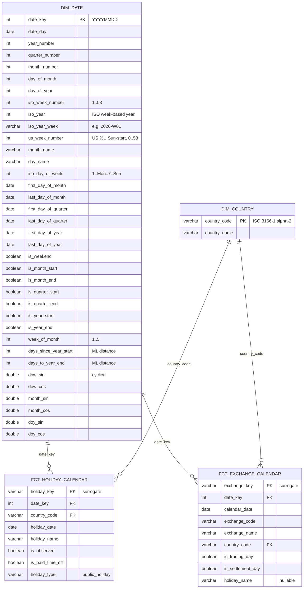

# dbt-duckdb-trading-calendar

<!-- BADGES:START -->
<!-- auto-generated by scripts/update_extension_badges.py — do not edit between these markers -->
| Badge | What it tracks |
| --- | --- |
| [](https://github.com/oluies/dbt-duckdb-trading-calendar/actions/workflows/ci.yml) | **CI** — `dbt build` + test against SQL Server 2022 on every push / PR |
| [](https://github.com/oluies/dbt-duckdb-trading-calendar/actions/workflows/elementary.yml) | **Elementary** — scheduled OSS data-observability HTML report |
| [](https://github.com/dbt-labs/dbt-core) | **dbt-core** `1.11.11` — pinned in `requirements.txt` |
| [](https://github.com/duckdb/dbt-duckdb) | **dbt-duckdb** adapter `1.10.1` — pinned in `requirements.txt` |
| [](https://duckdb.org) | **DuckDB** engine `v1.5.3` |
| [](https://duckdb.org/docs/stable/core_extensions/httpfs/overview) | **httpfs** core extension — reads the remote Parquet over HTTPS — installed `52afb42` |
| [](https://duckdb.org/docs/stable/core_extensions/azure) | **azure** core extension — Azure blob storage access for the Open Datasets feed — installed `2ad247d` |
| [](https://github.com/hugr-lab/mssql-extension) | **mssql** community extension — `ATTACH`es SQL Server so dbt writes the marts there — installed `51f4781` |
<!-- BADGES:END -->

A dbt project that builds a **date dimension** plus a **normalized,
Kimball-style holiday and exchange calendar** in SQL Server 2022,
using **DuckDB** (via `dbt-duckdb`) as the compute engine.

DuckDB reads the public Azure Open Datasets _Public Holidays_ Parquet
directly from blob storage and writes the resulting tables into a
SQL Server database (`Referensdata.azuredl`) over the DuckDB **mssql**
extension's `ATTACH`.

### DuckDB extensions

The three `ext:` badges above track the extensions this project loads
(see `profiles.yml`): `httpfs` + `azure` (core) pull the source Parquet
from Azure blob storage over HTTPS, and `mssql` (community) `ATTACH`es
SQL Server so dbt writes the marts there.

The badge versions are **commit hashes**, not release tags (e.g. `mssql`
`da0204c` is release v0.2.0). They are regenerated from the live
`duckdb_extensions()` catalog by `scripts/update_extension_badges.py` —
run on every push and on a weekly schedule by
[`.github/workflows/badges.yml`](.github/workflows/badges.yml), which
commits any change back to `main`. So the table refreshes automatically
when we bump a pin in `requirements.txt` or when an extension build
updates upstream. To check the versions yourself:

```sql
INSTALL mssql FROM community; LOAD mssql;
UPDATE EXTENSIONS;            -- name, repo, update_result, prev/current version
-- or, for install path + load state:
SELECT extension_name, extension_version, installed, loaded
FROM duckdb_extensions()
WHERE extension_name IN ('httpfs', 'azure', 'mssql');
```

> The `mssql` extension is still pinned single-threaded in
> `profiles.yml` (`threads: 1`); the thread-safety fix lands in v0.2.1
> once it reaches the DuckDB community repo. See the `threads` comment
> in `profiles.yml`.

---

## Setup

### 1. Prerequisites

- Docker (with `docker compose`)
- Python 3.10+
- On macOS the default compose file uses the official
  `mcr.microsoft.com/mssql/server:2022-latest` image which is linux/amd64.
  On Apple Silicon you can either let Docker Desktop emulate it via
  Rosetta, **or** pass `PLATFORM=arm-mac` to use the native arm64
  Azure SQL Edge image (see below).

### 2. Configure the SA password

```bash
cp .env.example .env
# edit .env -- replace SA_PASSWORD with something strong, e.g.:
#   openssl rand -base64 32 | tr -d '/+=' | cut -c1-24
```

The password must satisfy SQL Server's complexity rules (>= 8 chars,
contains three of: upper, lower, digit, non-alphanumeric).
`.env` is gitignored.

### 3. Start SQL Server and create the database + schema

**Default (linux/amd64 — works on Linux and via Rosetta on Macs):**

```bash
make db-up
make db-init
```

**Apple Silicon native (Azure SQL Edge, linux/arm64):**

```bash
make PLATFORM=arm-mac db-up
make PLATFORM=arm-mac db-init
```

> Caveat: Azure SQL Edge has been announced end-of-support by Microsoft
> (Sep 2025). It remains the only native arm64 option for dev as of
> 2026, and `dbt-duckdb`'s mssql ATTACH talks to it over the same wire
> protocol unchanged. Don't use it for production.

`db-init` creates a `Referensdata` database and an `azuredl` schema.
dbt creates and drops the **tables** inside that schema; the schema
itself is created here so no model needs `CREATE SCHEMA` privileges.

### 4. Install dbt and run

```bash
python -m venv .venv && source .venv/bin/activate
pip install -r requirements.txt

# profiles.yml lives in the repo root; tell dbt to look there.
export DBT_PROFILES_DIR=$PWD

dbt deps
dbt seed
dbt run
dbt test
```

The full end-to-end sequence:

```bash
make db-up && make db-init && \
  dbt deps && dbt seed && dbt run && dbt test
```

(prefix the `make` commands with `PLATFORM=arm-mac` on Apple Silicon).

### 5. Browse the marts (optional)

To explore the resulting tables in `Referensdata.azuredl` with a web SQL
client + table browser, use the opt-in **DBGate** service (open source, MIT).

**One command** (starts SQL Server, builds the marts into a local `.venv`,
launches DBGate, opens the browser, then prints the tables). It picks the
DB image by CPU architecture -- native arm64 Azure SQL Edge on Apple
Silicon, SQL Server on amd64:

```bash
scripts/view-marts.sh          # macOS / Linux
scripts\view-marts.ps1         # Windows (PowerShell)

scripts/view-marts.sh down     # tear it all down (down also works on .ps1)
```

**Or wire it up by hand** with the Makefile (assumes you have already run
`dbt seed`/`dbt run`):

```bash
make db-up        # if SQL Server isn't already running
make db-viewer    # starts DBGate, opt-in compose profile "tools"
# open http://localhost:8085  -- auto-connected as "Referensdata"
make db-viewer-down   # stop + remove the viewer when done
```

DBGate runs alongside SQL Server in docker-compose (it is **not** started
by `make db-up`). It auto-connects to the `mssql` service; `USE_SSL` +
`SSL_TRUST_CERTIFICATE` mirror the dbt profile's
`Encrypt=yes;TrustServerCertificate=yes` so it trusts SQL Server's
self-signed dev certificate. It opens focused on `Referensdata`; you can
run ad-hoc SQL or click through `azuredl.*` tables.

---

## Data model

Normalized, Kimball-style. **No** wide per-country boolean columns on
`dim_date`.



- **`stg_public_holidays`** – staging view of the Azure parquet, filtered
  to the country codes in `var('holiday_country_codes')`.
- **`stg_date_spine`** – ephemeral daily spine 2015-01-01 .. 2035-12-31
  from `dbt_utils.date_spine`.
- **`dim_date`** – country-agnostic, one row per day. `iso_day_of_week`
  uses DuckDB's `isodow()`, which always returns 1=Monday..7=Sunday and
  does NOT depend on any `SET DATEFIRST` / locale setting. ISO 8601
  week semantics are completed by `iso_week_number`, `iso_year`, and
  the text key `iso_year_week` ('2026-W01'). ISO 8601 is the convention
  for Sweden/EU and trading use; `us_week_number` additionally carries
  the US/Sunday-start convention (`strftime %U`, range 0..53, where days
  before the first Sunday of the year fall in week 0). Unlike ISO, US
  weeks never cross the year boundary, so `year_number` is the matching
  week-year and there is no separate US week-year column.

  Includes **ML feature columns** alongside the standard dim columns:

  - cycle-position booleans: `is_month_start`, `is_month_end`,
    `is_quarter_start`, `is_quarter_end`, `is_year_start`, `is_year_end`,
    plus `week_of_month` (1..5).
  - distance integers: `days_since_year_start`, `days_to_year_end`
    (both 0 on their boundary day).
  - cyclical encodings: `dow_sin/cos`, `month_sin/cos`, `doy_sin/cos`.
    Each `(sin, cos)` pair maps an ordinal onto the unit circle so the
    first and last value of the cycle sit adjacent (Sun -> Mon = 1 step,
    Dec -> Jan = 1 step) instead of being maximally apart. Useful for
    linear models, and as input features for tree models that don't
    natively model cycles. Day-of-year uses period 365.25 to average
    across the leap cycle. See scikit-learn's [Time-related feature
    engineering](https://scikit-learn.org/stable/auto_examples/applications/plot_cyclical_feature_engineering.html)
    example for the canonical pattern.

  We deliberately do NOT one-hot day_name / month_name / quarter into
  the dim -- modern ML frameworks accept integers, and one-hot at the
  warehouse layer couples the schema to a specific feature pipeline.
- **`dim_country`** – seeded from `seeds/dim_country.csv`. One row per
  country in `var('holiday_country_codes')`.
- **`fct_holiday_calendar`** – grain `(holiday_date, country_code)`.
  Surrogate `holiday_key` via `dbt_utils.generate_surrogate_key`.
  `holiday_type` always equals `'public_holiday'` for Azure rows; the
  column exists so de-facto / bank holidays can be unioned in later.
- **`fct_exchange_calendar`** – grain `(calendar_date, exchange_code)`.
  Seeded from `seeds/exchange_holidays.csv`. Lists **exception days
  only** (full closures + half-day sessions); ordinary trading days
  are inferred from "no row" plus `dim_date.is_weekend`.

The seed is pre-populated with **Nasdaq Stockholm (XSTO)** exception
days for 2024–2026 as a worked example.

### Using the cyclical encodings

The `(sin, cos)` pairs (`dow_sin/cos`, `month_sin/cos`, `doy_sin/cos`) place
each ordinal on the unit circle at angle `2*pi*(n-1)/period`, so cycle-adjacent
values are adjacent in feature space (Sun→Mon, Dec→Jan = one step). **Always
use both columns of a pair** — a lone `sin` is ambiguous (two phases share a
value); the pair is unique, like `(x, y)` on the circle.

**For ML** they give a model a smooth, wrap-aware view of calendar phase:

- Linear / logistic / GLM and neural nets can't express "December is next to
  January" from a raw `month_number`; the pair turns it into a smooth periodic
  signal. Add harmonics (`sin`/`cos` of 2×, 3× the angle) for richer seasonal
  shape.
- Distance / kernel models (kNN, k-means, RBF-SVM) get a Euclidean distance on
  the pair that respects cyclic proximity.
- Tree ensembles (RandomForest, XGBoost, LightGBM) can already split the raw
  integers, so the encodings are optional there — harmless, sometimes a small
  help. This is why the dim keeps **both** the raw ordinals and the encodings.

**For SQL / human analysis** a raw `0.43` isn't human-readable — for eyeballing
use `day_of_week` / `month_number` / the `is_*` flags. The pair is for cyclic
math:

```sql
-- phase angle in radians for the weekly cycle (0 = Monday)
atan2(dow_sin, dow_cos)                          AS dow_angle

-- cyclic similarity between two rows' weekly phase: the dot product of the
-- unit vectors -> 1 = same phase, 0 = a quarter-cycle apart, -1 = opposite
a.dow_sin * b.dow_sin + a.dow_cos * b.dow_cos    AS phase_cos_sim
```

They are **feature columns, not window-frame keys**: window functions still
`ORDER BY date_day`. The encodings feed seasonal features *inside* those windows
(rolling models, lagged features); they don't define the frame bounds.

**For changepoint detection (PELT and friends)** detectors like PELT (e.g.
Python [`ruptures`](https://centre-borelli.github.io/ruptures-docs/)), Binary
Segmentation, or Bayesian online changepoint detection find where a series'
statistics shift. Run naively on a seasonal metric they fire on the season
itself (every December). Use the cyclical features to remove that: regress your
metric on them (plus harmonics) and run the detector on the **residual** to
surface genuine regime changes; or pass them as covariates to a multivariate
detector so the expected seasonal mean-shift isn't flagged. The encodings model
seasonality cleanly — they are not changepoints themselves.

### Why normalized?

- **Scales to N countries with no schema change.** Wide per-country
  boolean columns (`is_holiday_se`, `is_holiday_no`, …) require a
  schema migration every time a new country is added and force a
  costly join-by-pivot for "what's a holiday today across our markets?"
- **Plays nicely with exchange calendars.** National public holidays
  and exchange closures aren't the same set — Swedish exchanges close
  on **midsommarafton** (not a Swedish public holiday) and trade
  half-days on certain eves. They need their own fact table; a
  per-country boolean on `dim_date` can't express that.
- **Future-proof for subdivision calendars.** Adding ISO 3166-2 level
  data (state/canton/county holidays) is a straight repeat of the same
  pattern: a `dim_subdivision` table keyed `(country_code,
  subdivision_code)` and a `fct_subdivision_holiday` fact with grain
  `(holiday_date, country_code, subdivision_code)`. Not built here;
  noted for later.

---

## Tests (`dbt test`)

`models/schema.yml` covers:

- `dim_date` – unique + not_null on `date_key`, `date_day`;
  `iso_day_of_week` in 1..7; `us_week_number` in 0..53. A singular test
  (`tests/assert_dim_date_week_numbers.sql`) also pins the ISO and US
  week columns to hand-verified values for well-known edge-case dates
  in `seeds/expected_week_numbers.csv`.
- `dim_country` – unique + not_null on `country_code`;
  `accepted_values` matching `var('holiday_country_codes')`
- `fct_holiday_calendar` – not_null on `date_key`, `country_code`,
  `holiday_date`; unique combination `(holiday_date, country_code)`;
  relationships to `dim_date` and `dim_country`;
  `accepted_values` on `holiday_type`
- `fct_exchange_calendar` – unique combination `(calendar_date,
  exchange_code)`; relationships on `date_key` and `country_code`

---

## Observability (Elementary OSS)

The [`elementary-data/elementary`](https://docs.elementary-data.com/oss/oss-introduction)
package is wired up but **disabled by default**. The
`.github/workflows/elementary.yml` workflow flips the gating var
(`with_elementary: true`), builds elementary's tables into
`Referensdata.elementary`, and publishes the resulting HTML report
(models, tests, lineage, run history) as a workflow artifact.

Triggered manually (`workflow_dispatch`), on push to `main`, and on a
weekly schedule. The main `ci.yml` is unaffected.

To generate locally:

```bash
pip install -r requirements-elementary.txt
dbt deps
dbt seed --vars '{with_elementary: true}'
dbt run  --vars '{with_elementary: true}'
dbt test --vars '{with_elementary: true}' || true
dbt run  --select package:elementary --vars '{with_elementary: true}'
edr report --profiles-dir "$PWD" --profile-target dev \
  --file-path elementary-report/index.html
open elementary-report/index.html
```

You'll need to pre-create the schema once:

```sql
USE Referensdata;
IF NOT EXISTS (SELECT 1 FROM sys.schemas WHERE name = N'elementary')
    EXEC('CREATE SCHEMA elementary');
```

---

## Nightly mssql-extension stress test (archived)

`.github/workflows/duckdb-mssql-nightly.yml.disabled` is a dormant
harness for re-running the full pipeline at `threads=4` and `threads=8`
against a freshly built `mssql.duckdb_extension` pulled from upstream
[`hugr-lab/mssql-extension`](https://github.com/hugr-lab/mssql-extension)
CI artifacts. The goal was to validate
[PR #127](https://github.com/hugr-lab/mssql-extension/pull/127)
("Thread-safe catalog entry lifetime") before it ships in a tagged
community-repo release.

It is **disabled** because DuckDB extensions are ABI-coupled to
libduckdb, and the upstream build is against a duckdb-main snapshot
(commit `f480e78`, 2026-02-13) -- not the released `1.5.x` line we
get from pip. Loading the upstream binary into pip's duckdb fails
with "extension built for different DuckDB version". Two dispatched
runs confirmed this.

**Reactivate** by renaming the file back to `.yml` once the upstream
fix lands in a tagged community release -- at that point the workflow's
premise (pre-place a freshly built binary) is no longer needed, and
the simpler path is to bump `profiles.yml`'s `dev` target from
`threads: 1` to `threads: 4`.

The `nightly` profile target in `profiles.yml` is kept as a local
convenience for `DBT_THREADS=N dbt run --target nightly` once the
fix is in the released community extension.

---

## Notes / decisions

### Source of holiday data

The project ships with the **Azure Open Datasets _Public Holidays_**
parquet. License: **CC BY-SA 3.0 (ShareAlike)**. It's a frozen
**1970–2099 snapshot** maintained by Microsoft, originally derived
from the same underlying Python `holidays` package.

The MIT-licensed [`holidays`](https://pypi.org/project/holidays/) PyPI
package is the same upstream source but is _current_ rather than
frozen, and would be a defensible swap if you need:

- continuously updated holiday data after the frozen snapshot ages,
- a more permissive license (MIT vs. CC BY-SA 3.0),
- subdivision-level (ISO 3166-2) holidays out of the box.

To swap: replace `stg_public_holidays.sql` with a Python model
(dbt-duckdb supports Python models) that imports `holidays`, builds
a DataFrame keyed `(country_code, date)`, and exposes the same
columns. The downstream model (`fct_holiday_calendar`) doesn't need
to change. We've kept the Azure source here because the requirement
calls for it; the rest of the pipeline is source-agnostic.

### iso_day_of_week and SET DATEFIRST

SQL Server's `DATEPART(weekday, …)` depends on the connection's
`SET DATEFIRST` value, which makes any column computed from it
non-portable. We compute `iso_day_of_week` in DuckDB using `isodow()`,
which is locale-independent and standards-aligned (ISO 8601:
1=Monday..7=Sunday). The integer is then written into SQL Server
as plain `INT`, so consumers can read it without ever issuing a
`SET DATEFIRST`.

### Schema management

- The schema `Referensdata.azuredl` is created by `make db-init` and
  is NOT created by any dbt model. dbt only manages **tables** inside
  it (create/drop). This avoids the SA-only-on-bootstrap surprise of
  bare `CREATE SCHEMA` statements inside models.

### Future extensions

- `dim_subdivision` + `fct_subdivision_holiday` keyed on
  `(country_code, subdivision_code)` for ISO 3166-2 sub-national
  calendars (German Länder, US states, UK constituent countries with
  separate bank holidays). Same shape as the country pair; not built
  now.
- A `dim_exchange` would naturally pair with the existing exchange
  fact once more than one exchange is in scope.

---

## Repo layout

```
.
├── .env.example              # template; copy to .env and edit
├── .gitignore
├── docker-compose.yml        # default (linux/amd64 SQL Server 2022)
├── docker-compose.arm.yml    # PLATFORM=arm-mac (linux/arm64 Azure SQL Edge)
├── Makefile                  # db-up / db-down / db-shell / db-init
├── requirements.txt          # dbt-core, dbt-duckdb
├── packages.yml              # dbt_utils
├── dbt_project.yml
├── profiles.yml              # uses DBT_PROFILES_DIR=$PWD
├── models/
│   ├── schema.yml
│   ├── staging/
│   │   ├── stg_public_holidays.sql
│   │   └── stg_date_spine.sql
│   └── marts/
│       ├── dim_date.sql
│       ├── fct_holiday_calendar.sql
│       └── fct_exchange_calendar.sql
└── seeds/
    ├── dim_country.csv
    └── exchange_holidays.csv
```
